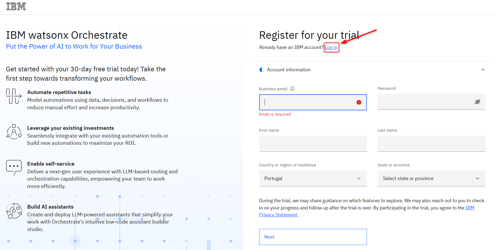
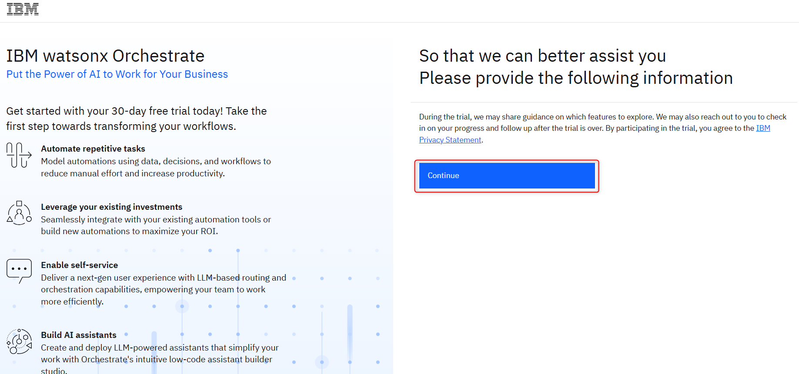
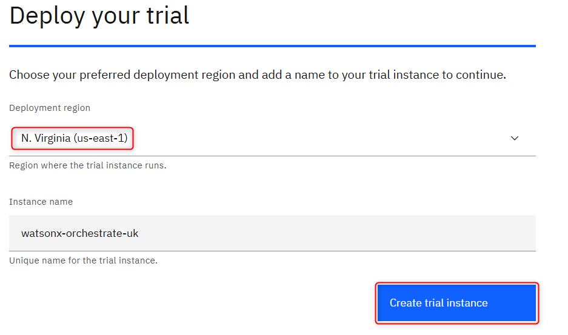
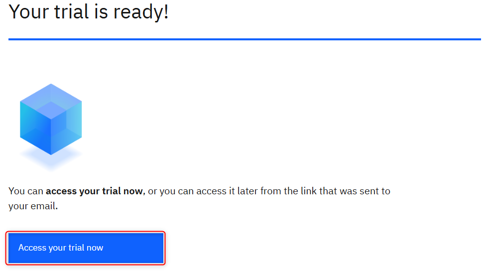
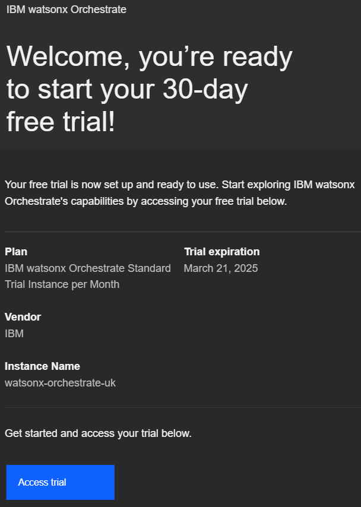
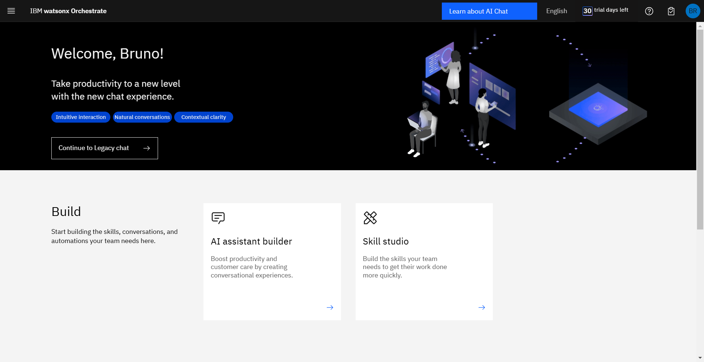

# Pre-work

## 1. Create your watsonx Orchestrate Trail environment
1. Open the [watsonx Orchestrate Trial](https://www.ibm.com/account/reg/us-en/signup?formid=urx-52753) link o provision your Trail environment.
If you already have an account, press the Log In link. If you don’t, please register on.

2. After successfully Logged in, press **Continue**.

3. On the “Deploy your trial” page, in the “Deployment Region” select **N. Virginia (us-east-1)**. In the “Instance Name”, feel free to leave the Standard Name or choose you own. Then click **Create trial instance**.

4. After you see the “Your trail is ready!” page, you will also receive an email with the confirmation. Press **Access your trail now**.

The email should be like this:

5. If you are on this page, it means that you have successfully provisioned your watsonx Orchestrate Trial.

Just a test
