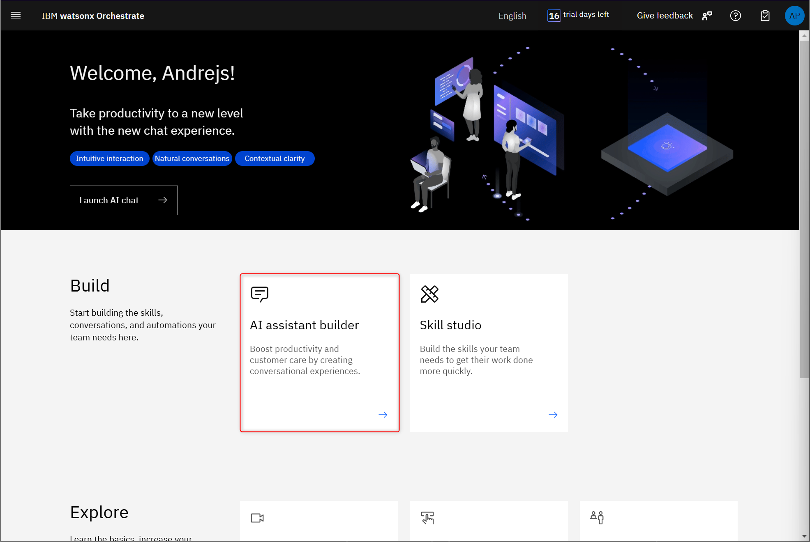
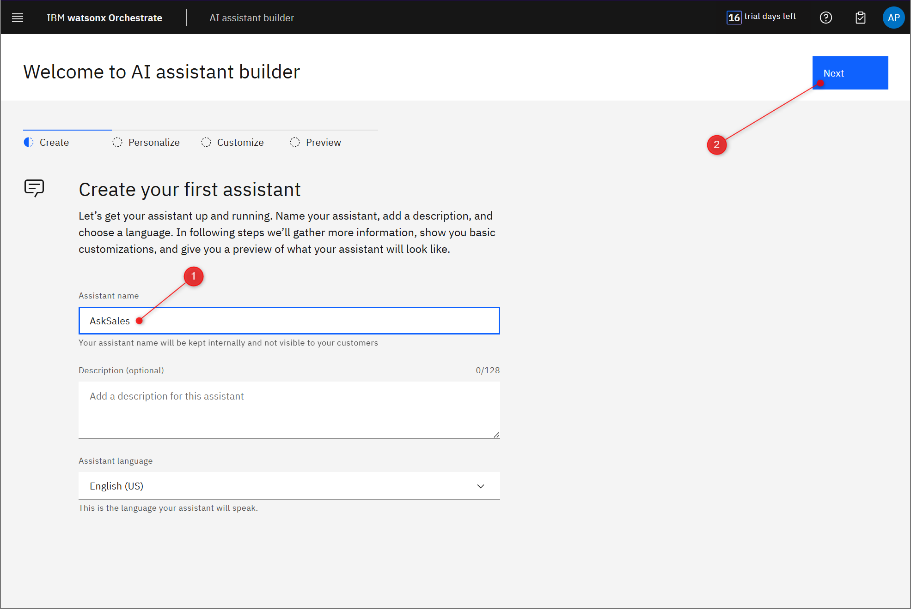
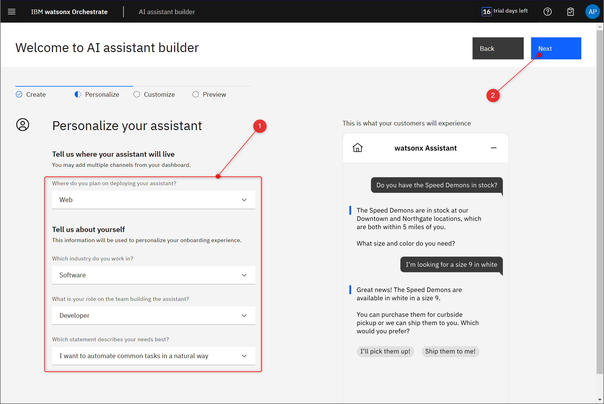
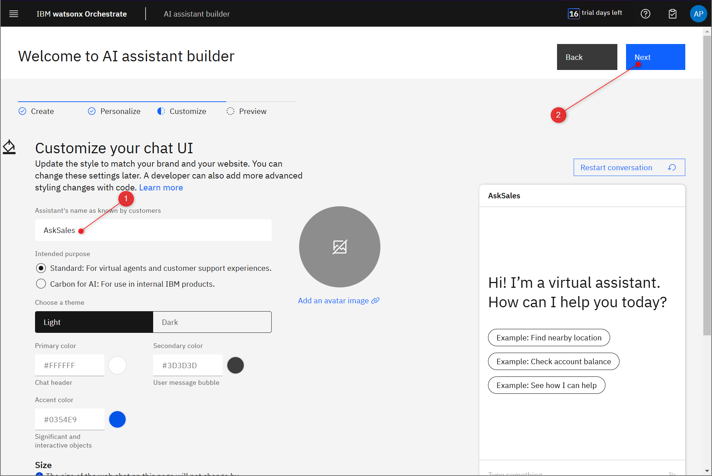
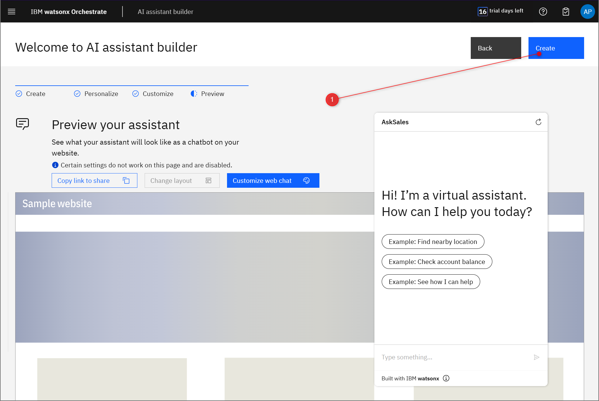
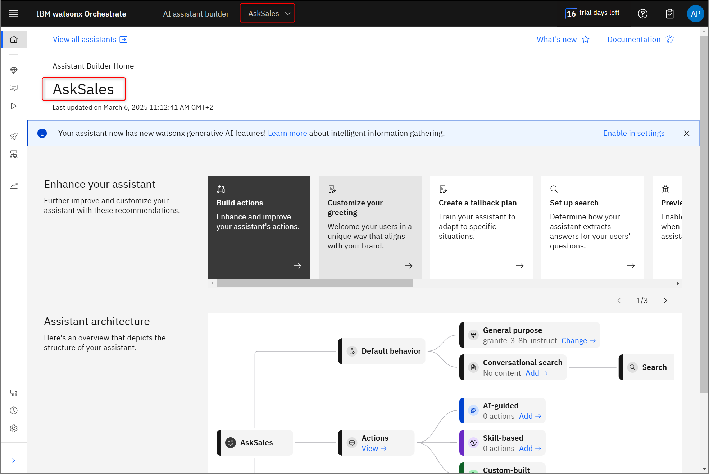

# Creating the Assistant

You will start by creating the assistant in the AI Assistant builder in watsonx Orchestrate.

### 1.  Start AI assistant builder.  

From the wxO home page, click AI assistant builder.

### 2.  Name your AI assistant.
    
Let's name our assistant 'AskSales' and give it a description if you like. When finished - click Next.

### 3.  Personalise your AI assistant. 
    
For this workshop we will deploy our AI assistant on the **Web**. 
    
Provide information about yourself. This information will not affect the assistant itself, but will be used to personalise your wxO onboarding experience.

### 4.  Customise AI assistant UI.

You can change the look and feel of the AI assistant. When finished - click Next.

### 5.  Preview AI assistant.

In this step, you can preview what your AI assistant will looks like when it is deployed on the web. Click Create to finish.

### 6.  Navigate to your newly created AI assistant home page.

You should be taken to your AI assistant's homepage. You will see the name of the selected AI assistant at the top of the page. You can switch between AI assistants if you have more than one.

Click on this link [https://dl.watson-orchestrate.ibm.com/assistants/](https://dl.watson-orchestrate.ibm.com/assistants/) if you are not automatically redirected to your AI assistant.

