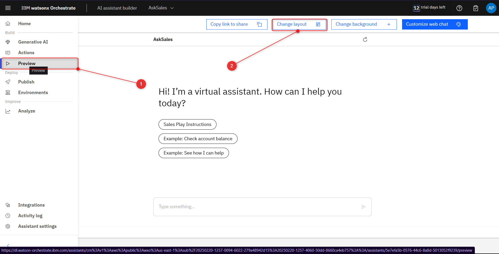
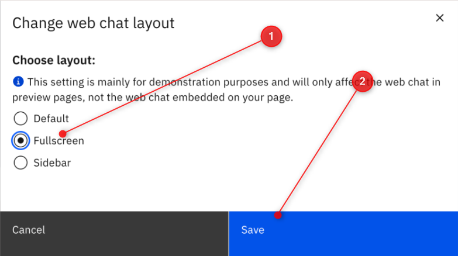
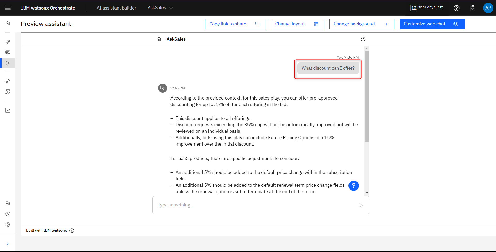
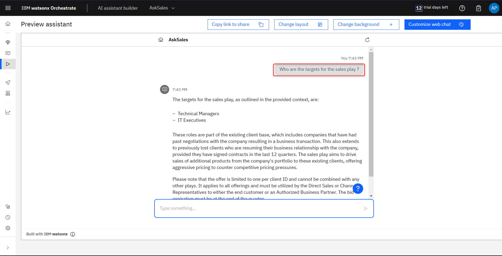
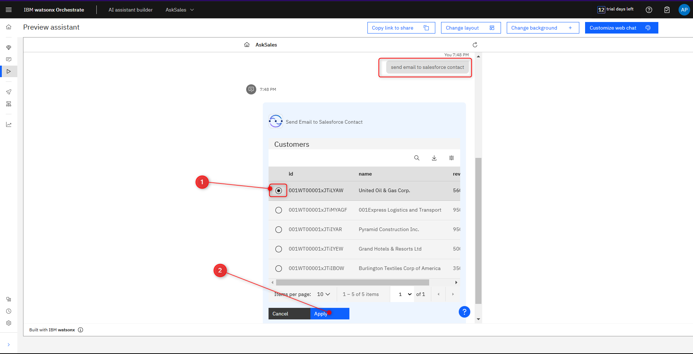
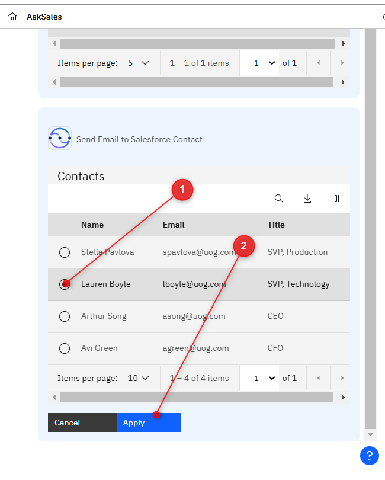
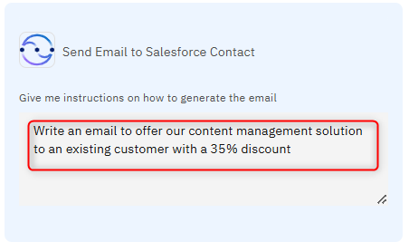
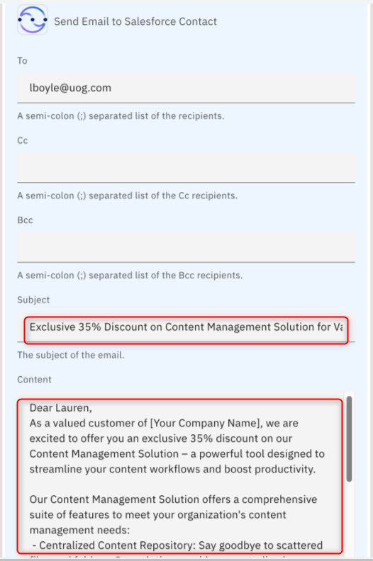

# Using AI Assistant

In this section, you’ll use AskSales AI assistant you've created to run end-to-end use case.

You can do it straight from the preview in the AI assistant builder.
 
From the AI assistant builder, click on Preview (1).

For better experience, we’ll use the full screen preview feature. Click **change layout** (2)

Choose the Fullscreen option, then click Save.

You should now be seeing your chat in fullscreen. Let’s start by leveraging the AI-guided 
action. Ask one of the utterances you used earlier when creating the action, such as 
“What discount can I offer?” 

The second question you could ask in this usecase scenario is “who are the targets for the 
salesplay ? The AI-guided action should provide a response that mention Technical managers and IT executives. 

We could ask more questions about our sales play document, but now that we have the essential information about the discussion and who we should be targeting with our sales play, let's move on to the next step.

Use the utterance “send email to salesforce contact” to trigger your Skillflow Based Action. 

Using the custom Salesforce skill you created, the AI assistant asks the Salesforce application for the current accounts you are responsible for.

Pick the first company option (1), United Oil & Gas Corp and click Apply (2). 

This will triger the next action from our skillflow. 

We asked previousl who is a target for our Sales Play. So select Lauren, Technology SVP.

Next skill from our skillflow is triggered. AI assistant ready to generate professional email about our offer. Give LLM some guidance on what to include in the email.

The email and subject are generated by LLM and the AI assistant is ready to send it using the Send Email skill from the our skillflow. 

You can notice that an email signature is also created.  If you want, you can add your own email to the Cc field to receive a copy of the generated email. If you like, you can revise the content of the email before sending it. When finished, click Apply.

You should get a message that the email has been sent. If you sent the email to yourself, you'll get a message like the one below. Note that there is still some missing information in the message that was not automatically filled in by the GenAI, such as the company name of the sender of the email. This information can be filled in manually by running the scenario and reviewing the email's content, or by further improving the GenAI's ability by providing more context in the Prompt input.

