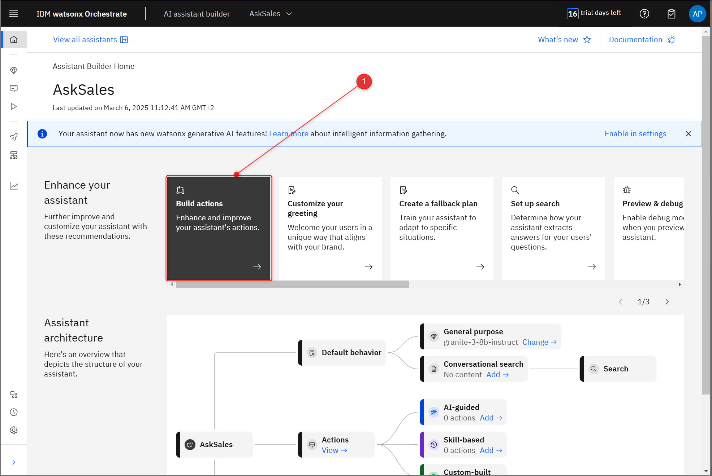
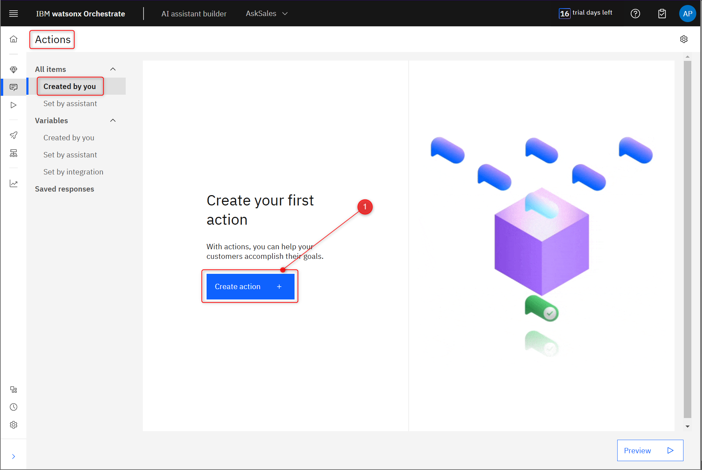
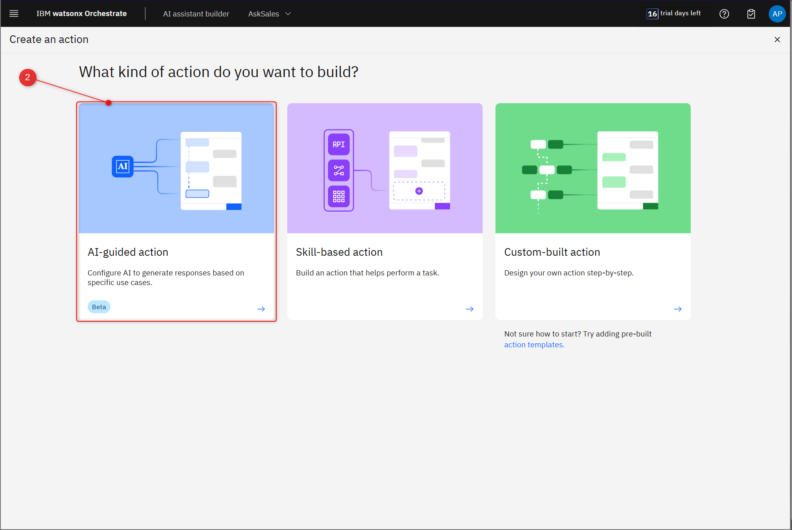
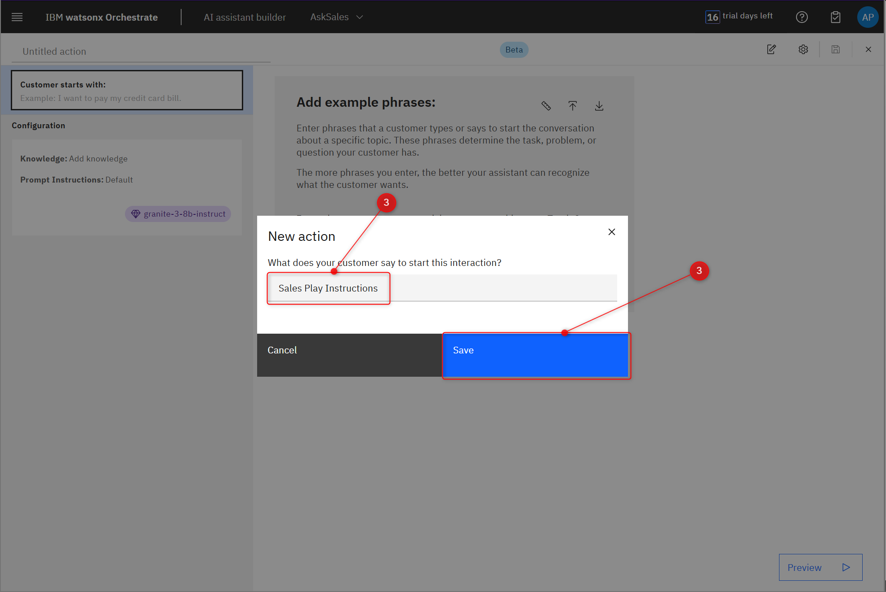
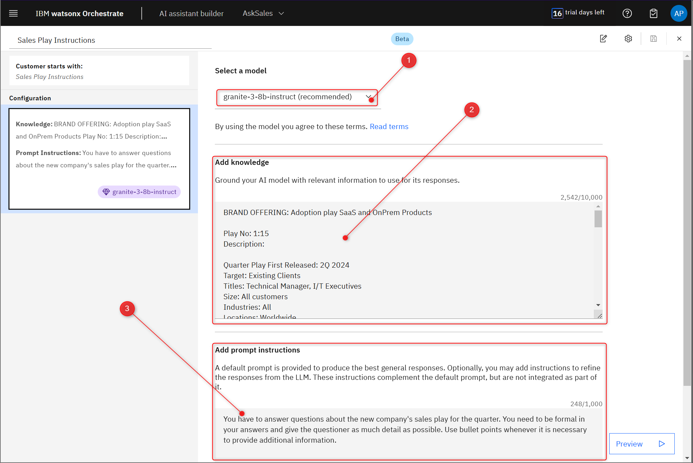
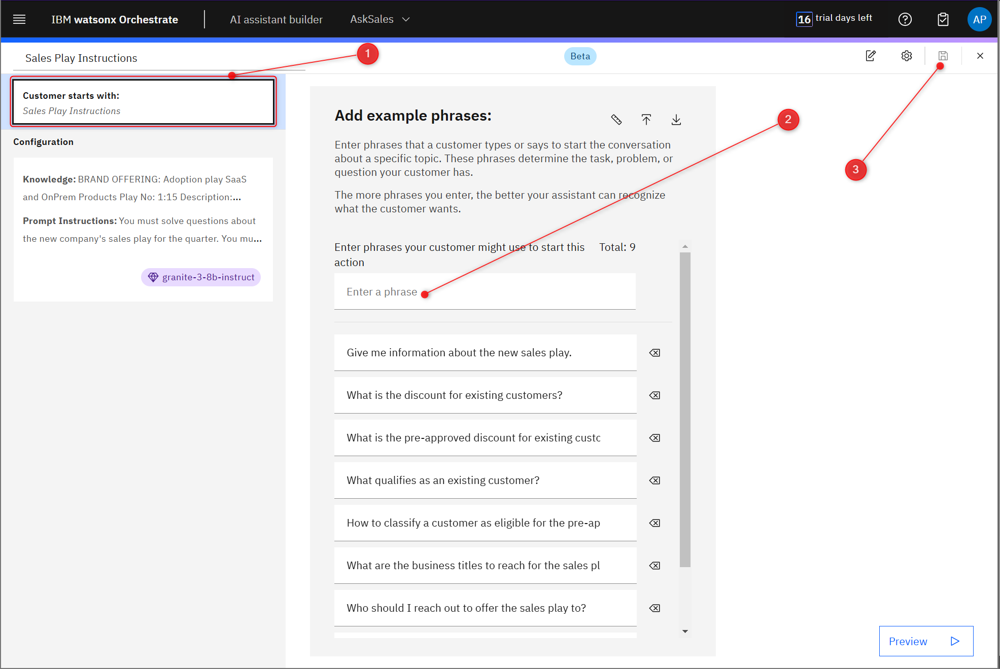
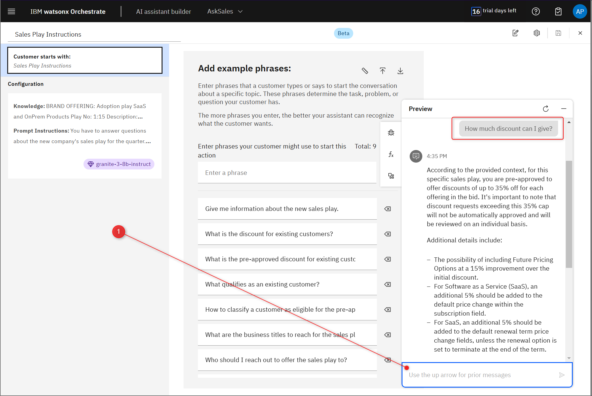

# Creating the AI guided Action.

In this part of the workshop, we will create an AI-guided action in our AI assistant. This will enable it to answer user questions using the company's knowledge base. This is the fastest way to realise RAG pattern without the need for a dedicated vector knowledge store like Milvus.

## 1. Navigate to the **Actions** section.

From the AI assistant hompage click **Build actions.**

## 2. Create new AI-guided action.

When in **Actions** section, click **Create Action** (1), then choose **AI-guided action** (2). Name your action **Sales Play Instructions** (3) and then click **Save** (4).

 

## 3. Configure your AI-guided action.

On this screen, you can configure your AI-guided action. There are several settings you can tweak, so let’s do this step-by-step.

By clicking on the **Select a model** (1) field, you can expand the options for the Large Language Model to be used by your AI-guided action. There are several options, including third party LLMs such as llama. For this tutorial, choose the IBM's **granite-3-8b-instruct** LLM. You can always experiment with other LLMs later.

Under **Add Knowledge (2)** you can add the written content that will serve as the knowledge base for your AI-guided action. This will be the source of truth for all answers provided by the assistant when this AI-guided action is triggered (limited to 10,000 characters). In this tutorial you will use the content of the **[sales-play.dotx](../assets/sales-play.docx)** file, which simulates the specification for a new Sales Play offer, a pre-approved discount for existing customers. First, download the file from the link above.

Once you have downloaded the Sales Play document, open it, copy the entire content and paste it into the **Add Knowledge (2)** box. You can just paste it as it is, no need to change anything.

Finally, click **Add Instructions** to provide prompt instructions to our LLM. Copy and paste following text to the prompt instructions box **(3)**: 

You have to answer questions about the new company's sales play for the quarter. You need to be formal in your answers and give the questioner as much detail as possible. Use bullet points whenever it is necessary to provide additional information.

## 4. Add example phrases to AI-guided action.

Now we need to train our AI assistant to recognise when to use our action. We do this by providing some examples of the questions users typically ask about the new Sales Play document.

To do this, click **Customer starts with (1)**. You will notice that there is already one example phrase present. 

To add more phrases, click the **Enter phrase** field and enter the following questions/phrases one at a time.

- What are the products that qualify for the sales play?
- Who should I reach out to offer the sales play to?
- What are the business titles to reach for the sales play?
- How to classify a customer as eligible for the pre-approved discount?
- What qualifies as an existing customer? 
- What is the pre-approved discount for existing customers?
- What is the discount for existing customers? 
- Give me information about the new sales play.

When you have finished entering your questions, click the save icon (3).

## 5. Test your AI-guided action.

Now you can try out your AI-guided action. Click **Preview** at the bottom right corner to open AI assistant. Try interacting with it by entering the question (1) related to the Sales Play document. The AI Assistant will call up your AI-guided action, look up the answer in the Sales Play document provided, and return the answer back to you.

