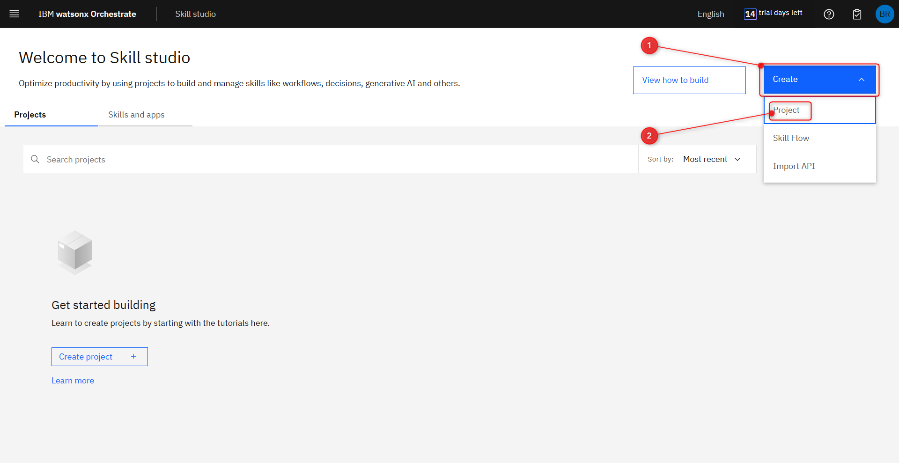
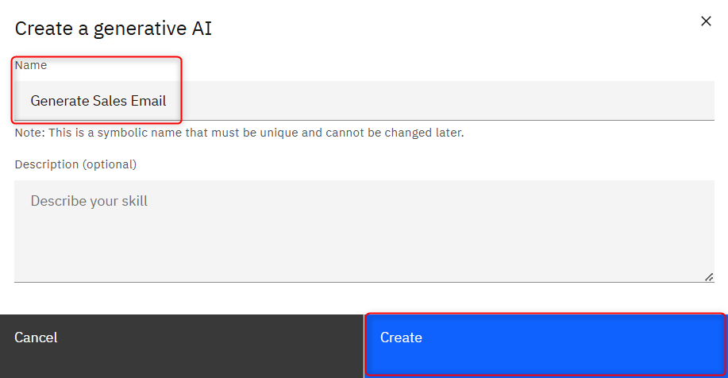
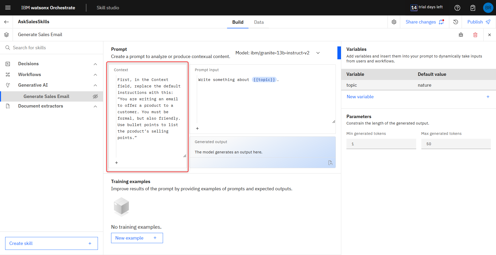

# Create GenAI Skill for email body generation

In this part of the workshop, we will create a GenAI skill specialized in generating emails to offer products to customers. This will be part of your AskSales assistant as a Skill based action

## 1. Start the **Skill studio**

From the wxO home page, click **Skill studio**

## 2. Create a new Skill Project.

In the **Skill Studio** section, click on **Create** (1) to the top right, and then in **Project** (2).

On the **New Project** pop up, insert the name of your project, such as **AskSalesSkills** (3), then click create (4).

## 3. Get started with the skill type.

Inside of the project, choose the Skill type **Generative AI**.

Name your GenAI skill as **"Generate Sales Email"**, then click **Create**.

## 4. Training the GenAI step-by-step on prompt lab.

In this, you will need the [Email Examples document](../assets/email-examples.docx) to use the email samples as training samples for the GenAI on your skill.
First, in the Context field, replace the default instructions with this: **“You are writing an email to offer a product to a customer. You must be formal, but also friendly. Use bullet points to list the product’s selling points.”**

Then, on the **Model** (1) field, you can experiment with different Large Language Models to see what results you get later on, but for now, pick the **mistralai/mixtral-8x7b-instruct-v01** (2).

At the bottom of the prompt lab, you can find the **Training examples field**. This is where you’ll use the email examples from the file you downloaded earlier. This will enhance the GenAI’s performance and accuracy when generating the email messages for your **AskSales Assistant**.
To get started, click on **New example +** to add a new training sample.

On the **Email Examples document**, you will ind 3 email samples. Each email sample refers to a different 
software product, with several selling points listed for each of them. These output samples make 
the Generative AI capable of identifying what product it should reference in the email message and 
what selling points to mention. This enhances the generated email messages with significant 
context about a company’s products. This could be further enhanced with more samples, such as 
variations of selling points and message structure for each product, or even more products.

## 5. Adding examples.

On the **Email Examples document**, you will ind 3 email samples. Each email sample refers to a different 
software product, with several selling points listed for each of them. These output samples make 
the Generative AI capable of identifying what product it should reference in the email message and 
what selling points to mention. This enhances the generated email messages with significant 
context about a company’s products. This could be further enhanced with more samples, such as 
variations of selling points and message structure for each product, or even more products.

For the first example, use this input: **“Generate an email message to offer our Content Management Solution to a customer”**, and copy the **Email 1** from the Email Examples file and paste it in the **Expected output** field of the first example.

Repeat the same steps to add the **Example 2 and 3**. 
On the Example 2 use **Automation Platform** and in the Example 3 **Customer Relationship Management system**.

## 6. Generating content.

With all the training examples ready, the next step is to set up the **Variables** and the **Parameters**.

In GenAI skills, variables can be created and mapped to the 
Prompt input. This way, you can create customized prompts and insert the variables at specific points in the prompt to ask the user 
for specific inputs to compose the prompt. For this lab, we will simulate wxO capturing 
information from a logged-in user (in this case, a sales specialist that is the persona of the demo 
scenario) by leveraging several variables with hardcoded values.

Let's start by adding the next **Variables** and leave all the **Default value** blank (1):
- Email Generation Prompt;
- User Name;
- Role;
- User Email;
- Customer Name.

For the Parameters, Set **Min generated tokens** to 100 and **Max generated tokens** to 600 (2). This defines how much content the AI generates when prompted. 

At the center of the prompt lab, you can find the 
Prompt input. This is the actual prompt that 
gets sent to the AI for content generation. This prompt is not displayed to the user when they 
trigger the GenAI skill, only the variables you created for the skill. 

To test the generative AI, type one of the example prompts from earlier in the 
**Prompt input** (1) field and click **Generate** (2) to 
see the content generated by the GenAI. You can also try using different prompts to see the 
variations you can get from the training you provided to the AI. 

The output should be similar to this:

## 7. Mapping the Prompt input.

First, delete the Prompt input and then, press on **"+"** to select **Email Generation Prompt**.

You should see this in your Prompt Input:

To enhance the email generated by the GenAI, we will use a customized, pre-made prompt. 
The idea here is to have the user provide the beginning of the prompt, indicating how they want the 
email to be generated, and then have the rest of the prompt provide more details, such as how to 
compose the email signature. We don’t want the user to see all the variables we created for this 
GenAI skill, so we’ll use a custom form in a skill flow to do this later on in this lab.

Keep in mind that this is one of the main advantages of having the Prompt input from the prompt lab 
not be displayed to the user. This way, you can create customized, pre-made prompts and just ask 
the user for specific inputs to compose the entire prompt to the GenAI.

Use this prompt in your Prompt input: 

**"{{Email Generation Prompt}}. The customer's name is {{Customer Name}} and the signature at the
end of the email message should be composed of {{User Name}} as the sender's name, {{Role}} as
the sender's position, and {{User Email}} as the sender's contact information."**

Now, to test our Prompt, let's add some Default values for each variable (1):
- **Email Generation Prompt:** Write an email to offer our content management solution at 35% discount
- **User Name:** John Seller
- **Role:** Sales Specialist
- **User Email:** john.seller@ibm.com
- **Customer Name:** Jane Customer

And click **Generate** (2) to test the result with that values. Your results may vary, but 
you’ll notice the GenAI used the values from the variables to compose the email (3).

Now, delete the values you inserted for each variable, leaving them empty. You finished 
creating your GenAI skill.

