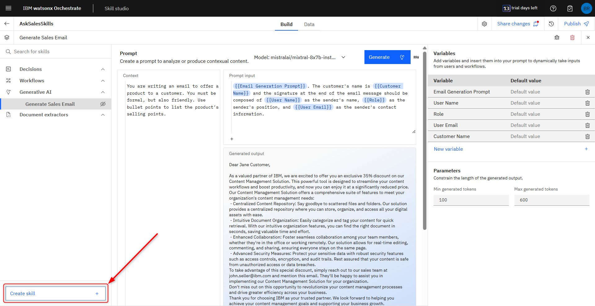
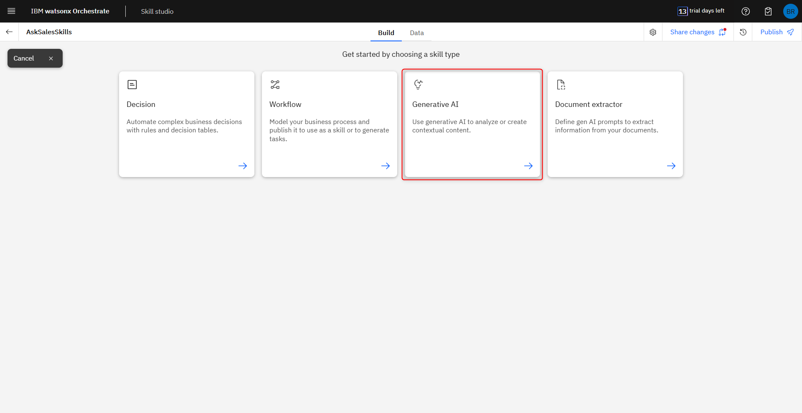
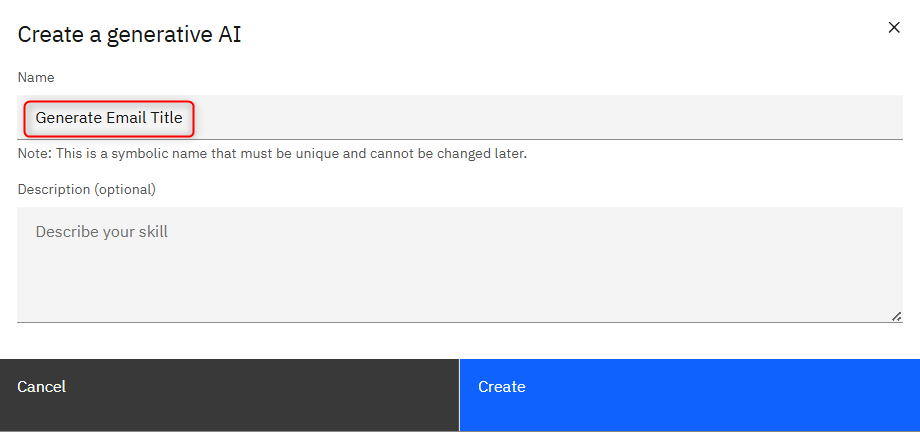
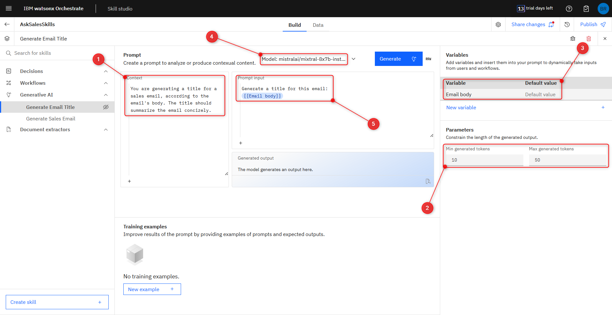
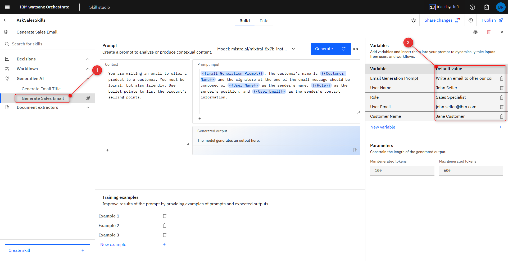
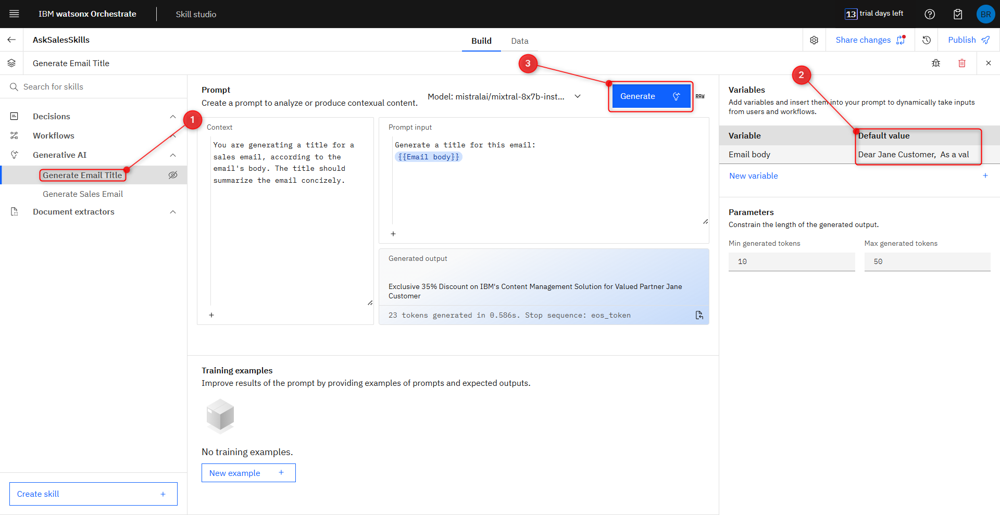
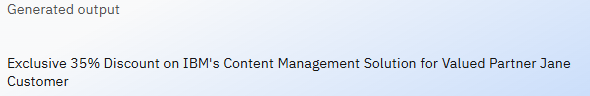
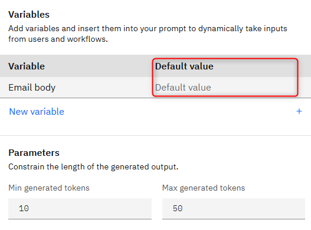

# Create GenAI Skill for email title generation

In this part of the workshop, we will create a GenAI skill for generating titles for the email 
generated by the skill you created in the previous section. This is a way to 
dynamically generate titles for each email and personalize it for each customer

## 1. Creating a new skill.

In the same page you were in the previous part (the build tab of your project), click **Create skill**. 

Click on **Generative AI**.

And name it **"Generate Email Title"**, then press **Create**.

## 2. Inside the new skill.

In the **Context** field, use this text: **"You are generating a title for a sales email, according to the 
email's body. The title should summarize the email concizely."** (1), and choose in **Parameters** - **Min generated tokens** as 10 and the **Max generated tokens** as 50 (2).

Change the variable name to **"Email body"**, erase its default value (3), define the LLM model as **mistralai/mixtral-8x7b-instruct-v01** (4), and Use this prompt in the Prompt input field: **“Generate a title for this email: {{Email body}}”** (5).

## 3. Testing the skill.

To test our new skill, we need to go to the previous one to generate an email.

Go to the **Generate Sales Email** skill (1) and set the **Default value** again in the **Variables** (2):
- **Email Generation Prompt:** Write an email to offer our content management solution at 35% discount
- **User Name:** John Seller
- **Role:** Sales Specialist
- **User Email:** john.seller@ibm.com
- **Customer Name:** Jane Customer

Press **Generate** and copy the generated email.

After that, go back to the **Generate Email Title** skill (1), and past the email generated into the **Email body** variable (2). Click **Generate** (3).

After generated, you will notice it references several key pieces of information from the email, such as the discount percentage, the product being offered, and even the customer’s name:

To finish, delete the value you inserted in the Email Body 
variable, leaving them empty. 

