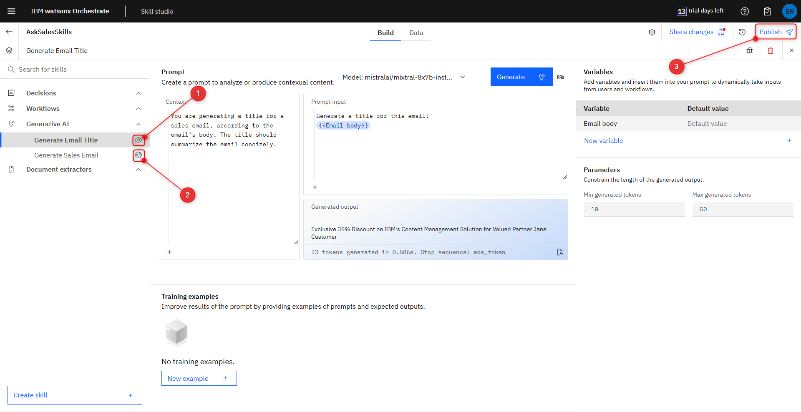
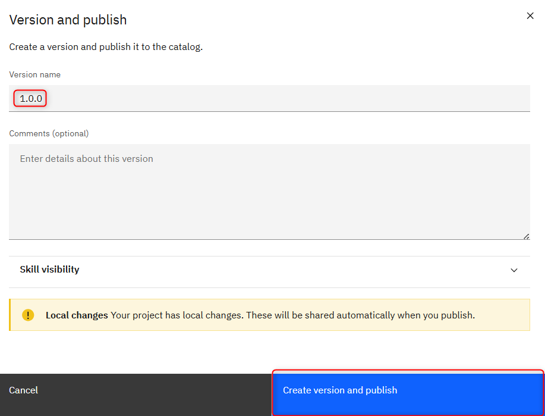
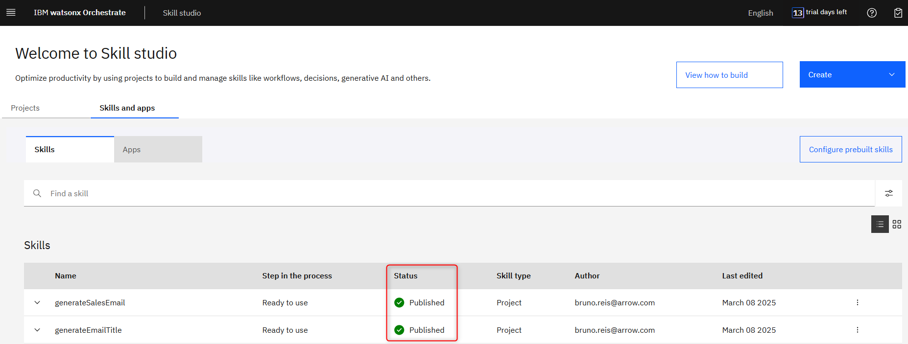

# Publishing the GenAI Skills

In this part of the workshop, we will publish the GenAI skills you’ve built in the previous section.

## 1. Making the skills public.

On your project’s **Build tab**, notice the crossed eye icon next to the GenAI skills you created (1). This means the skill is still set as private. Click the eye icon to make it a public skill (like the (2)).
After making sure both of your skill are public, click on **Publish** to the top right (3).

Name this first version of your project as **1.0.0**, then click **Create version and publish**.

Now if you go to the Skills and apps tab of your Skill Studio, you should see both GenAI skills you created in your project.

