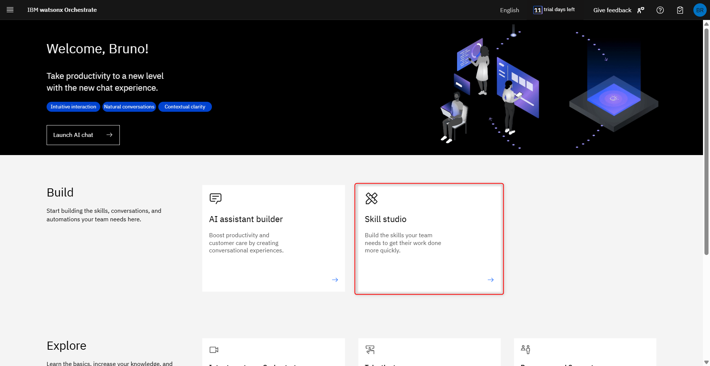
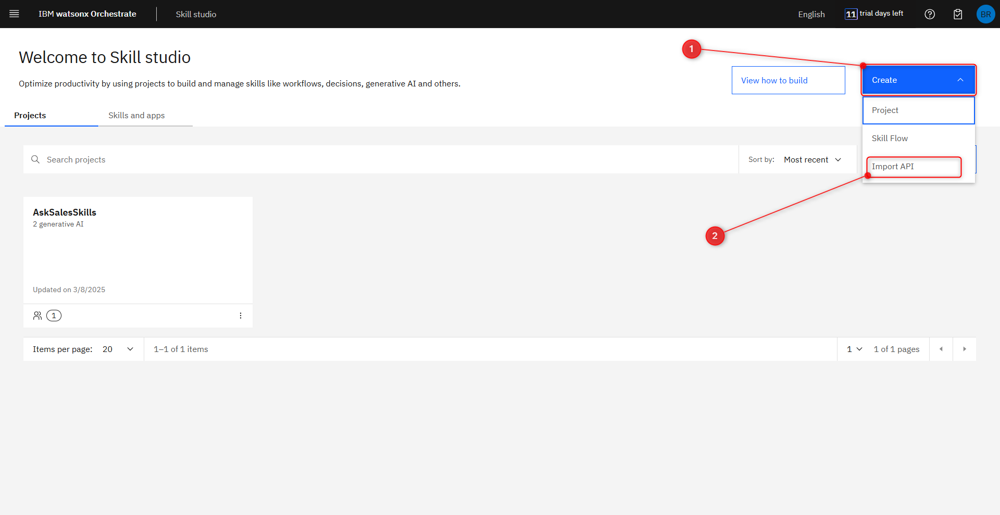
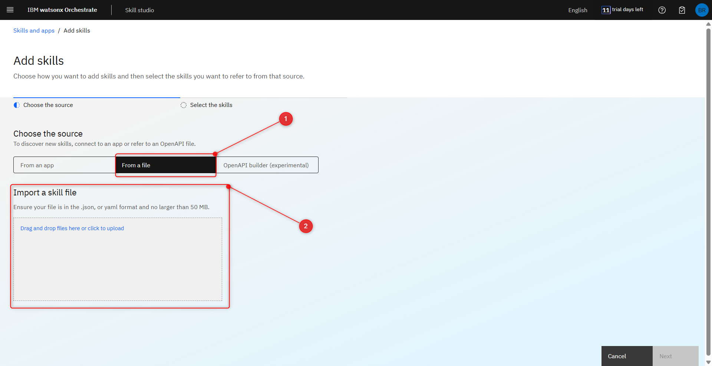
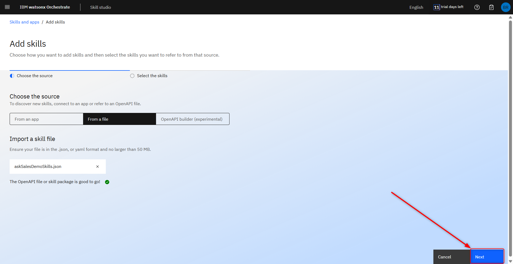
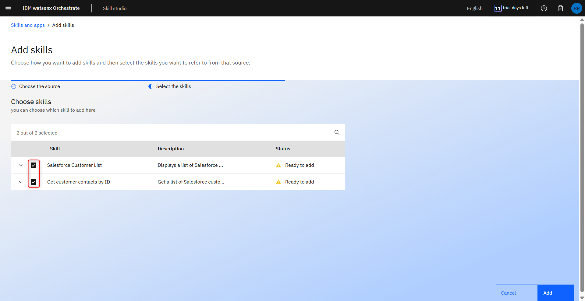
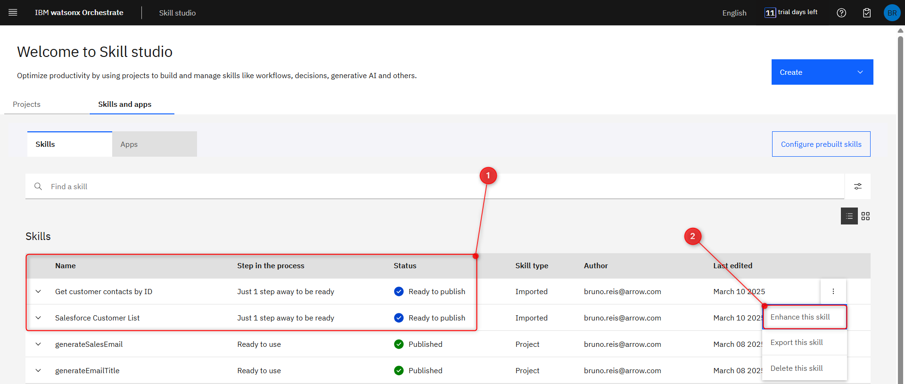
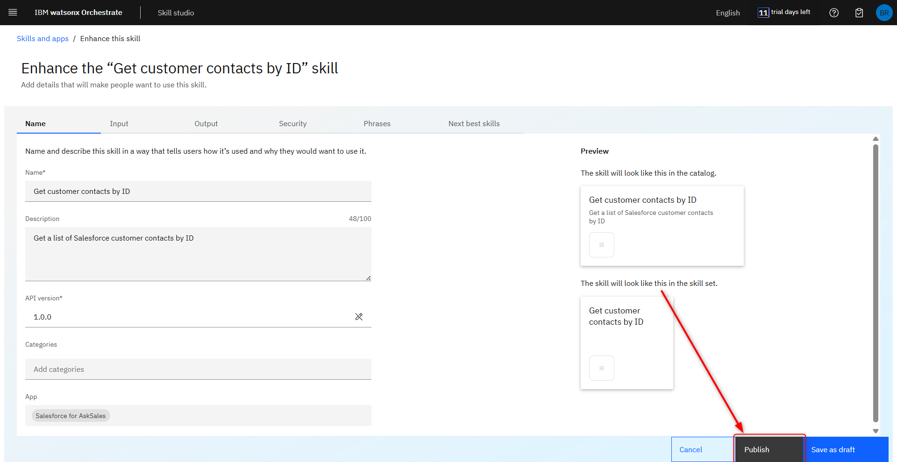
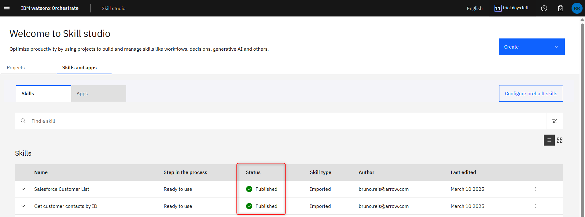

# Import custom skills

In this section, you’ll import and publish the salesforce demo skills that 
compose the AskSales demo flow.

## 1. Importing a file to Skill Studio.

First, make sure to download the [AskSales demo skills](../assets/ask-sales-demo-skills.json) if you haven’t already.

Enter the **Skill Studio**.

Press **Create** (1) and then **Import API** (2)

On the **Add skills** screen, click on **From a file** (1) and click on Drag and drop (2) the **askSalesDemoSkills.json** file you downloaded previously into the indicated field or click on Drag and drop files (2) here or click to upload to open a file selection window and pick the askSalesDemoSkills.json file.

After the successful validation, click **Next**.

You should see two skills in the Choose skills screen, the **Salesforce Customer List** and the **Get customer contacts by ID** skills. Make sure both are **selected** before clicking on **Add**.

## 2. Publish your skills.

You should be able to see the **imported skills** in the **Skills and apps tab** of the wxO **Skill studio** (1).

Now, to publish the skills, click on the ellipsis button to the right of one the skills, then click on **Enhance this skill** (2). 

On the next screen, There is no need to customize anything, so click on **Publish**.

Repeat the same steps to publish the other skill. You should see both imported skills as **Published** in the **Skills and apps tab** of the **Skill studio**.

