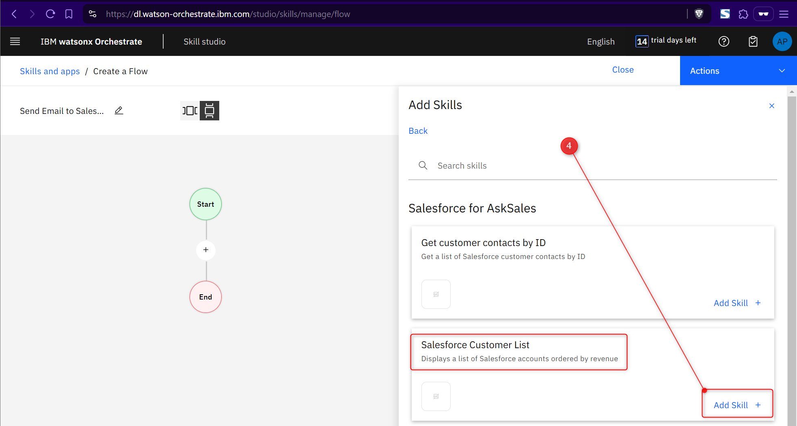
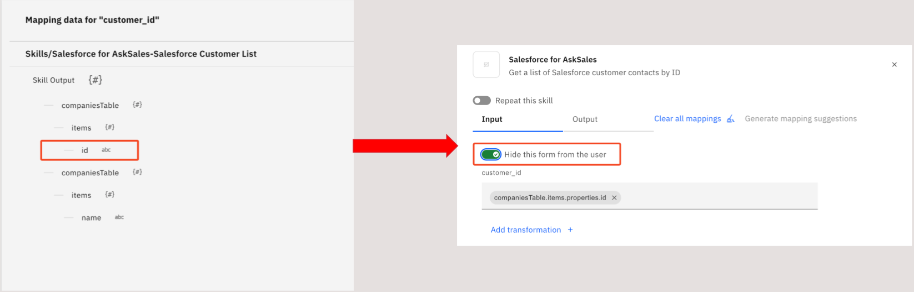
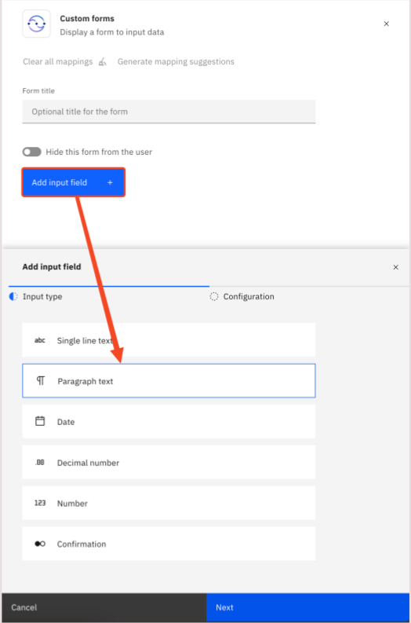
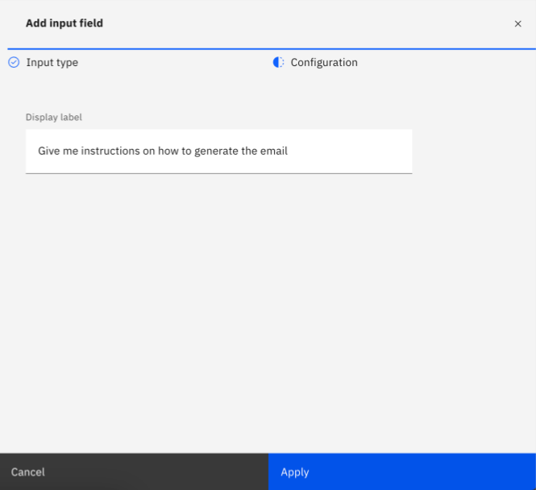
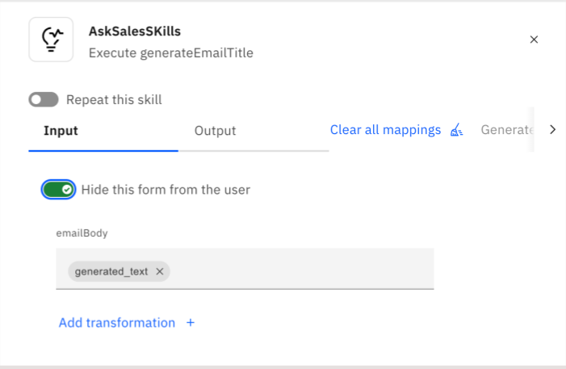
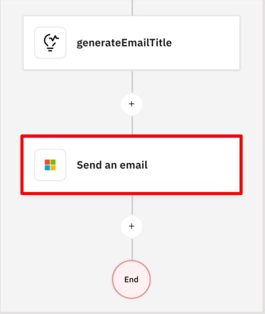
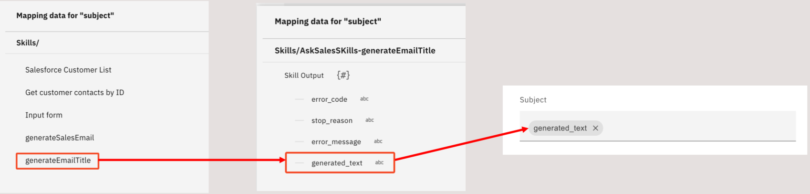
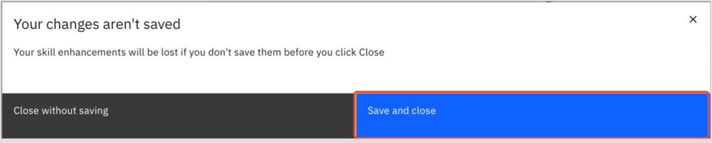

# Creating the Skillflow

In this section, you’ll create the Skillflow that will be used as a Skill-based action in your AskSales AI assistant.

## 1. Navigate to Skill Studio

From the watsonx Orchestrate hompage click **Skill Studio**

## 2. Create new skillflow

Click on Create dropdown and then select **Skill flow** (1)

 

Click on the Pencil icon (1) and name (2) your skillflow **Send Email to Salesforce Contact**.
 

## 3. Add Skills to the Skillflow

Add skill to the skillflow by clicking on the + icon (1) between Start and End.
On the side panel that appears, search for **Salesforce for askSales** on the search bar (2), then find and **click** the Salesforce for AskSales (3).

You will see two skills from **Salesforce for askSales**.

Add **Salesforce Customer List** skill to the flow by clicking on Add Skill (4).

Complete the same steps to add five more skills to the flow.

- From "Salesforce for askSales" add Get customer contacts by ID

- From "Custom forms" add Input form

- From "AskSalesSkils" add generateSalesEmail

- From "AskSalesSkill" add generateEmailTitle

- From "Microsoft Outlook" add Send an email 

When finished, your skill flow should look similar to the image below:

You must now start mapping the inputs and outputs of the skills in the flow. First, click on the **Get customer contacts by ID** skill 

On the side panel that opens up, click on the customer_id field, then click on the Salesforce Customer List option

Click the id input option, then enable the Hide this form from the user toggle

Now click on the Input form between the Get customer contacts by ID and the generateSalesEmail skills

Click on Add input field on the panel that opens to the right. Then choose on the Paragraph text option and click Next

In the Display label field, write this: “Give me instructions on how to generate the email”. We are using this 
to make the prompt that shows up to the user for the GenAI skill to be more conversational, and have a 
larger input field (paragraph input as opposed to simple text input). When you’re done, click Apply.

Now click on the generateSalesEmail skill to configure its inputs

You’ll see all the variables you made when creating this skill as inputs here. Most of them will 
used to enhance the prompt sent to the GenAI, as we saw earlier. There are several ways to populate 
these variables dynamically, but for this demo, we’ll hard code values in most of them, only leaving 
the emailGenerationPrompt be mapped to dynamic inputs. Let’s do this step-by-step.

Hover the mouse over the Role field and a pencil icon will show up to its right. Click on this icon to specify
a default value for this variable

Write Sales Specialist as the default value for the Role field

For the userName and userEmail fields, you can insert your own name and email or create a 
name and email for the demo’s persona. As mentioned previously, these pieces of information could 
be acquired dynamically through several ways, and the intention here is to simulate watsonx 
Orchestrate getting this data from the profile of the user that is logged in. Since the focus of this 
demo is to demonstrate AI-guided actions and custom GenAI skills, let’s continue with hardcoded 
information to proceed faster.

Now, click on the customerName field to map its input

Map the Name output of the Get customer contacts by ID skill to the customerName field

Now click on the emailGenerationPrompt field to map its input

Map the Give me instructions on how to generate the email output of the Input form to the emailGenerationPrompt field

To finish setting up the generateSalesEmail skill, enable the Hide this form from the user toggle

Now, click on the GenerateEmailTitle skill

Map the generated_text output of the generateSalesEmail skill to the emailBody field

Enable the Hide this form from the user toggle on the generateEmailTitle skill

Finally, let’s setup the Send an email skill

Click on the body.Content field

Click on the generateSalesEmail option, then click generated_text

Now click on the Subject field

Map the generated_text output of the generateEmailTitle skill to the Subject field. 
Be careful not to confuse it with the generated_text output from the generateSalesEmail skill!

Now click on the To field

Click on the Get customer contacts by ID option, then click Email

Next, to finish creating your skill flow, click on Actions to the top right

Click Enhance

On the message box that pops up, click Save and close

On the enhancement screen, click Publish to the bottom right

You should now see the Send Email to Salesforce Contact skill flow among the published skills in your tenant.

