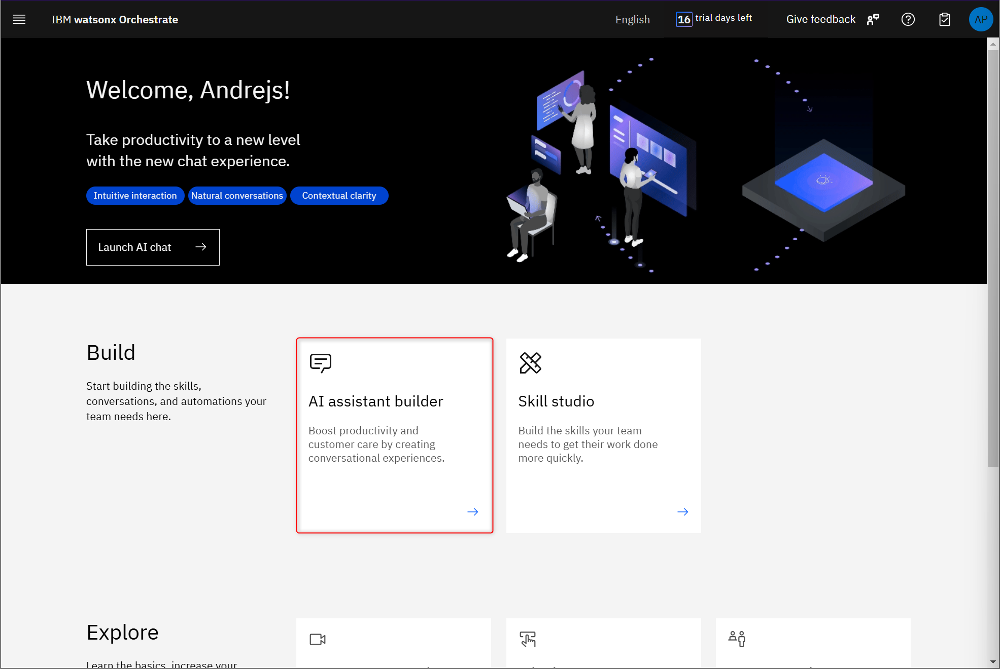
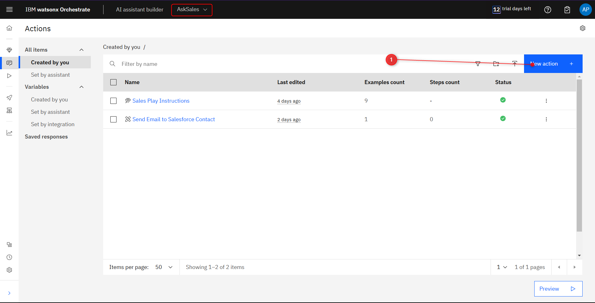
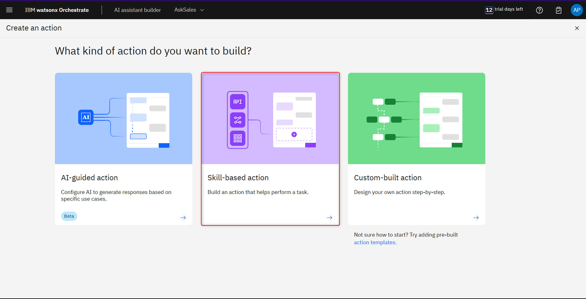
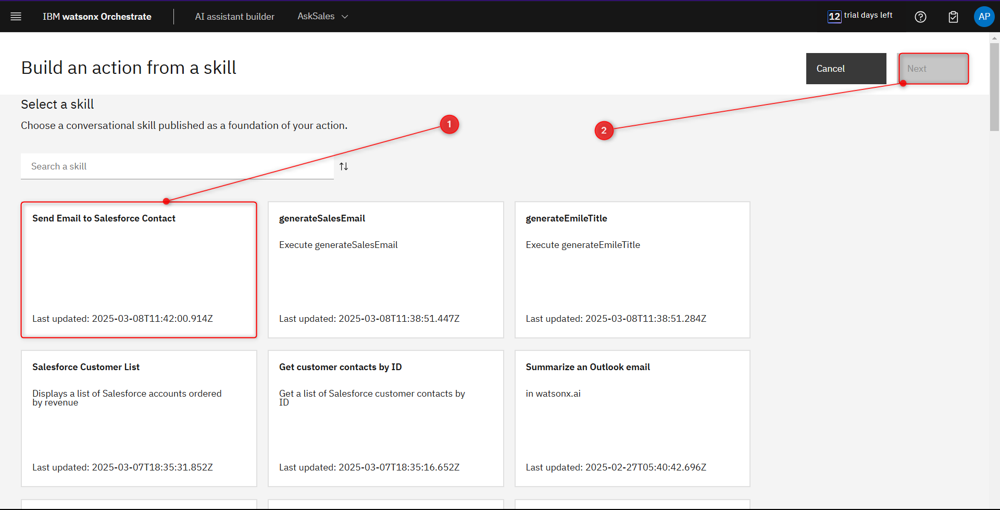
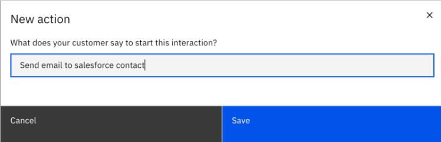
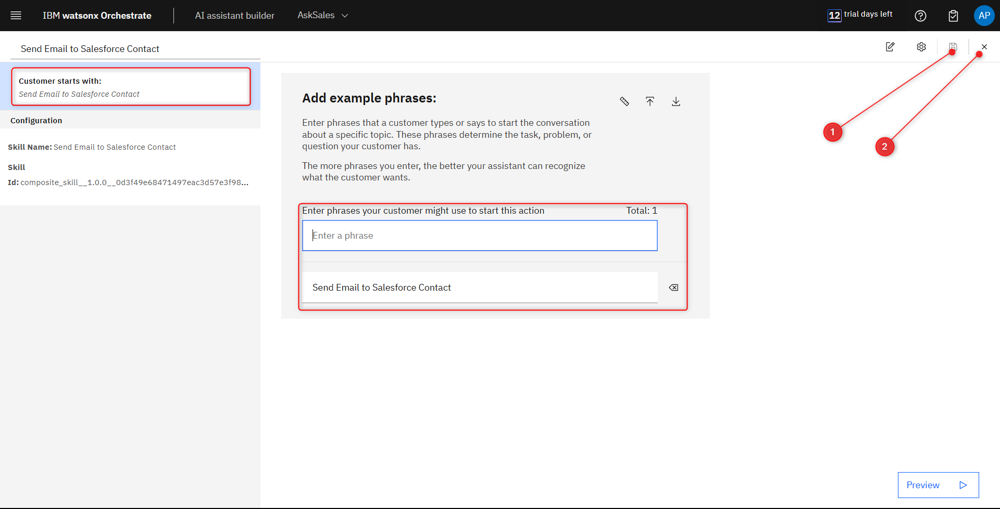
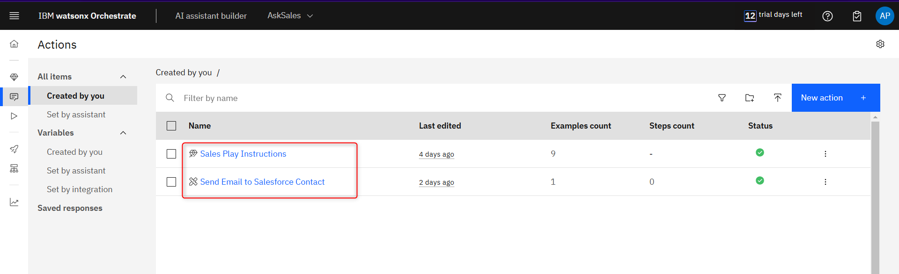

# Creating the Skillflow based action in AI assistant

In this section, you’ll crate the skillflow based action for your AskSales assistant.

From wxO’s home page, go to the AI assistant builder

From the AI assistant hompage click New actions.

Click on Skill-based action

Search for the **Send Email to Salesforce Contact** skillflow you created earlier. Click on its tile to select it (1), then click Next (2).

Name this action the same as the skill flow it’s based on, then click Save

On this screen, you can add other utterances to trigger this skillflow-based action, or you can just 
leave the default utterance, which is the name of the skill-based action itself. When you’re done, 
click the disk icon (1) to the top right to save your action. Then close it by clicking (2).

You should now see the AI-guided action you created earlier, along with the new Skillflow-based action 
you just created.

